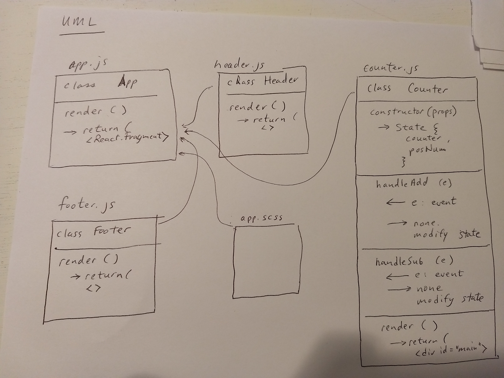

 LAB
=================================================

## LAB - React Testing and Deployment (Lab 27)

### Author: Kevin O'Halloran

### Links and Resources
* [repo](https://github.com/Kevinoh47/lab-27-from-codesandbox)
* [travis](https://travis-ci.com/Kevinoh47/lab-27-from-codesandbox)
* [AWS](http://lab-27-401.s3-website-us-west-2.amazonaws.com/)
* [codesandbox](https://codesandbox.io/s/x9vl046jmp)

Note that the amazon deployment is not working correctly because paths to the js are incorrect. I have tried deploying twice with the same results.

### Modules
#### `counter.js`
##### Exported Values and Methods

###### `render() -> React.Fragment`
render returns a section that includes links to add or subtract from the counter, and a span class that contains the counter itself, which is a react state object. 

###### `handleUp `
an event handler that takes a click event and increments the counter.

###### `handleDown `
an event handler that takes a click event and decrements the counter.

### Setup

#### Running the app
* `npm start`
* Endpoint: `localhost:3000`

#### Tests
* npm run tests
* assert is alive at application start.
* assert changes state by decrementing the counter when down link is clicked.
* assert changes state by incrementing the counter when up link is clicked. 

#### UML

